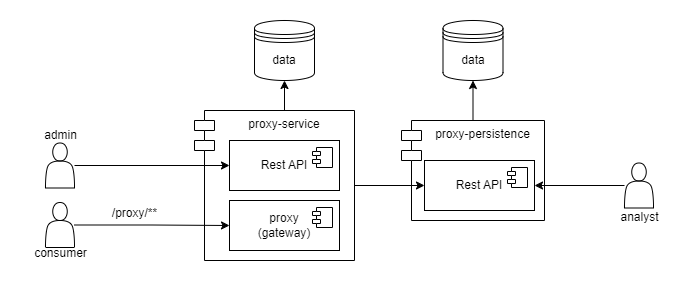
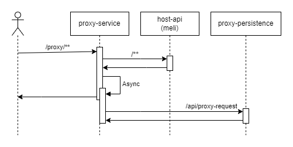

# proxy-meli
Este proyecto funciona como un proxy para un host (para este caso `https://api.mercadolibre.com`), el cual tiene una cantidad límite de solicitudes dependiendo ciertos parámetros (ip, path, etc) de los request que son interceptados, el proyecto está construido por dos servicios ([proxy-service](proxy-service/README.md) y [proxy-persistence](proxy-persistence/README.md)) que interactúan entre sí y persisten su información es una base de datos MongoDB.## Configuración
## Features
- Redireccionar y validar solicitudes realizadas al path del proxy
- Habilitar path de consumos del proxy
- API de estadísticas de consumo del proxy
- API de acceso a proxy

### Ejecución con Docker
Para ejecutar el proyecto usando Docker y Docker Compose:
```bash
  docker-compose up --build
```
Esto levantará los servicios **proxy-service**, **proxy-persistence** y **MongoDB**.

## Stack
En la carpeta `/stack` vas encontrar algunos elementos que te ayudara a probar o ejecutar el proyecto
### Coleccion de postman 
`/stack/meli proxy.postman_collection.json`

Vas a encontrar la coleccion de postman donde puedes consultar las API de **proxy-service**, **proxy-persistence**
## Stack tecnologico
Para el desarrollo de este proyecto se hizo uso de del framework `Spring boot 3.3.4` y `java 17`, para la persistencia de datos se hizo uso de `MongoDB`
## Componentes
El proyecto maneja 3 roles:
- admin: gestiona los accesos
- consumer: encargado de hacer uso del proxy
- analyst: encargado de observar los datos de las solicitudes



un actor puede tener cualquiera de los 3 roles dependiendo la necesidad
## secuencia proxy
para la ejecucion del proxy hacemos uso de un path(`/http://localhost:8080/proxy/**`) en **proxy-service**, donde dependiendo de los permisos de acceso que tenga disponible podra seguir con la solicitud, finalizado la validacion se ejecutara de forma asincrona se guardara el registro de solicutud por medio de un endpoint expuesto en **proxy-persistence**


